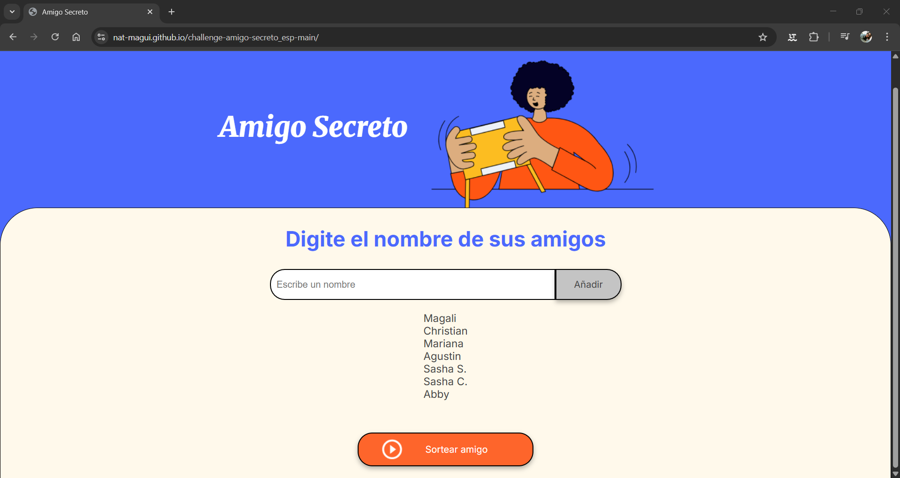
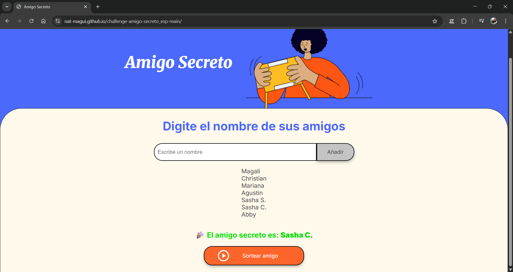

# 🎁 Challenge ONE – Amigo Secreto  

Aplicación desarrollada en el marco del programa **Oracle Next Education (ONE) + Alura Latam** para practicar **lógica de programación en JavaScript**.  
El objetivo es permitir que un usuario ingrese una lista de amigos y realice un sorteo aleatorio para determinar quién es el **amigo secreto**.  

  
  
  
  

---

## 📋 Índice
- [Descripción del Proyecto](#-descripción-del-proyecto)
- [Estado del Proyecto](#-estado-del-proyecto)
- [Funcionalidades](#-funcionalidades)
- [Vista Previa](#-vista-previa)
- [Acceso al Proyecto](#-acceso-al-proyecto)
- [Tecnologías Utilizadas](#-tecnologías-utilizadas)
- [Autor](#-autor)
- [Licencia](#-licencia)

---

## 📖 Descripción del Proyecto
Este proyecto pone en práctica conceptos esenciales de **lógica de programación**:
- Variables  
- Condicionales  
- Funciones  
- Arrays (listas)  
- Bucles  
- Selección aleatoria con `Math.random()`  

---

## 🚧 Estado del Proyecto
✅ Proyecto finalizado y entregado.  

---

## 🔨 Funcionalidades
- **Agregar nombres:** los usuarios escriben en un campo de texto y los añaden a la lista.  
- **Validar entrada:** si el campo está vacío, muestra un mensaje de error.  
- **Visualizar lista:** todos los nombres ingresados se muestran en pantalla.  
- **Sortear amigo:** selecciona un nombre aleatorio de la lista y lo muestra como resultado.  

---

## 👀 Vista Previa

- Lista de amigos agregados:  
    

- Sorteo realizado:  
    

---

Abrir el archivo `index.html` en el navegador.

---

## 🛠️ Tecnologías Utilizadas

* **HTML5**
* **CSS3**
* **JavaScript (ES6)**

---

## 📝 Licencia

Este proyecto fue desarrollado con fines educativos en el marco del programa **Oracle Next Education (ONE)** en conjunto con **Alura Latam**.
Uso libre para aprendizaje y práctica personal.

